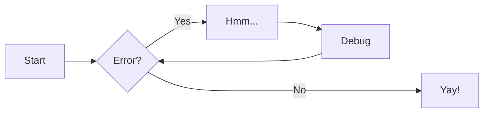
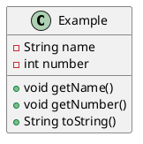

# Backstage Example Docs

Lorem ipsum etc.



Bleep bloop 🤖

```plantuml
id="myDiag" format="png" classes="uml myDiagram" alt="My super diagram placeholder" title="My super diagram" width="300px" height="300px"
  Goofy ->  MickeyMouse: calls
  Goofy <-- MickeyMouse: responds
```

Ahoy there ⛵️


